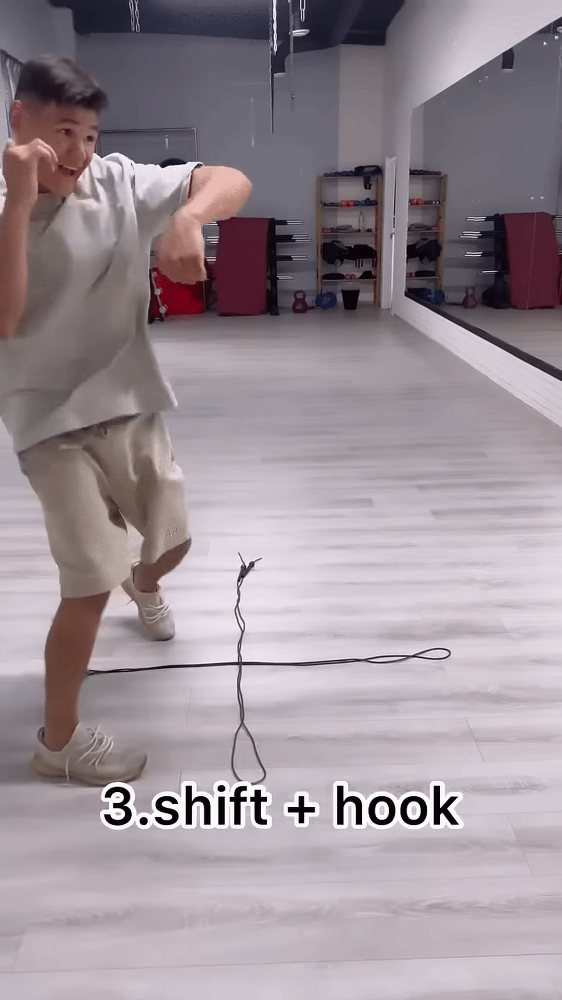
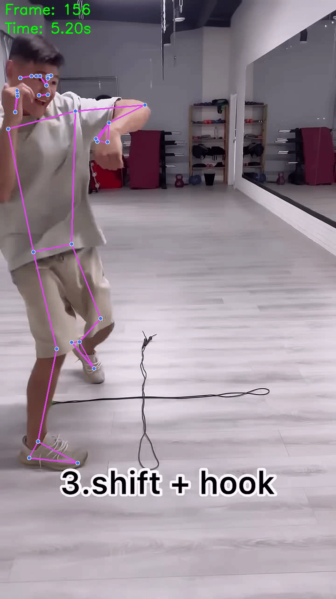
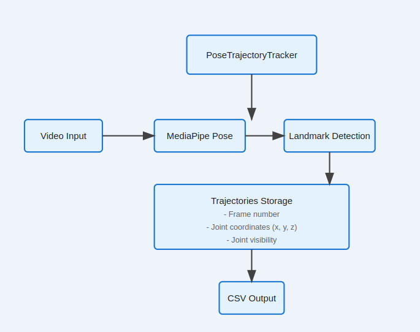
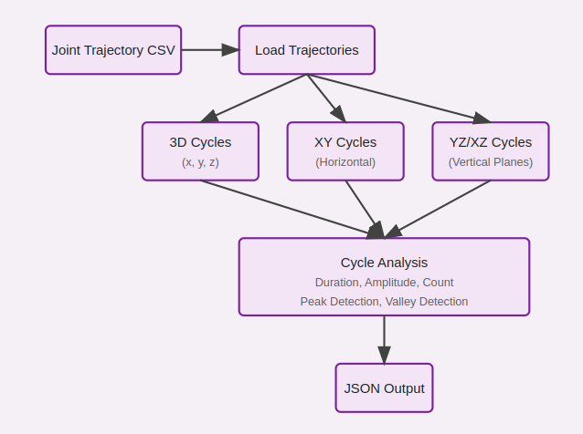

# Cycle detection in human joint movements

A Python-based solution for tracking human body joints in videos and detecting motion cycles.

Input Video                        |  Joint Tracked                     |
-----------------------------------|------------------------------------|
 | | 


## Problem Design

### Objectives
- Track human body joints in video footage
- Extract 3D trajectories of key body joints
- Detect and analyze cyclic patterns in joint movements
- Generate detailed analysis reports in CSV and JSON formats

### Scope
The project focuses on:
- Single-person videos
- 12 major body joints (shoulders, elbows, wrists, hips, knees, ankles)
- 3D position tracking (x, y, z coordinates)
- Cycle detection in various motion planes (3D and 2D projections)

### Constraints
- Requires clear visibility of the person in the video
- Subject should remain within camera frame
- Designed for single-person analysis
- Dependent on MediaPipe's pose detection accuracy
- Minimum of 4 data points required for cycle detection

## Data Preparation
```shell
# Download example video
yt-dlp -S ext:mp4:m4a https://www.youtube.com/shorts/DftBUdHgr9Q -o DftBUdHgr9Q.mp4
```
### Input Requirements
- Video file featuring a single person
- Clear visibility of body joints
- Stable camera position recommended

### Data Processing Pipeline
1. **Video Processing**
   - Frame extraction using OpenCV
   - RGB color space conversion
   - Frame-by-frame pose detection

2. **Joint Tracking**
   - MediaPipe pose detection
   - 3D coordinate extraction
   - Confidence score tracking
   - Missing data handling

3. **Data Transformation**
   - Normalization of joint coordinates
   - Trajectory smoothing
   - Time series formatting
   - Export to structured CSV format

## Code Organization

### Project Structure
```
|── CycleDetection.py
├── getPoseLandmarks.py
├── input
│   └── DftBUdHgr9Q.mp4
├── output
│   ├── cycles.json
│   └── trajectories.csv
└── README.md

```

### Key Components



1. **getPoseLandmarks.py**
   - `PoseTrajectoryTracker` class
   - Video processing functions
   - Joint coordinate extraction
   - CSV output generation



2. **CycleDetection.py**
   - Cycle detection algorithms
   - Multi-plane analysis
   - Statistical calculations
   - JSON report generation

### Data Flow
1. Video Input → Frame Processing → Pose Detection → Joint Tracking → CSV Output
2. CSV Input → Trajectory Analysis → Cycle Detection → JSON Output

## Test Cases

### Input Validation
- Video file existence and format checking
- Frame count verification
- Resolution and quality assessment

### Pose Detection
- Single person in frame
- Multiple body positions
- Different lighting conditions
- Various movement speeds

### Cycle Detection
- Regular cyclic movements (walking, running)
- Complex patterns (exercise routines)
- Irregular movements
- Edge cases:
  - Very slow movements
  - Rapid movements
  - Partial cycles
  - Missing data points

### Output Verification
- CSV format integrity
- JSON structure validation
- Data consistency checks
- Numerical accuracy

## Further Optimizations and Improvements

### Performance Enhancements
- Implement parallel processing for video analysis
- GPU acceleration for pose detection
- Optimize memory usage for large videos
- Batch processing capabilities

### Accuracy Improvements
- Enhanced filtering techniques for noisy data
- Advanced cycle detection algorithms
- Machine learning-based pattern recognition
- Multi-person tracking support

### Feature Additions
- Real-time analysis capabilities
- Interactive visualization tools
- Additional motion metrics
- Custom cycle definition support
- Automated report generation
- Integration with other motion analysis tools

### User Experience
- GUI development
- Progress monitoring
- Error handling improvements
- Configuration file support
- Batch processing interface

### Code Quality
- Unit test coverage
- Documentation improvements
- Code modularization
- Performance profiling
- CI/CD pipeline integration

## Usage

### Installation
```shell
# Install required packages
pip install opencv-python mediapipe numpy pandas scikit-learn tqdm
```

### Running the Analysis
```shell
# Step 1: Track joints in video
python3 getPoseLandmarks.py  -i input/DftBUdHgr9Q.mp4 -o output/trajectories.csv [-d]

# Step 2: Detect motion cycles
python3 CycleDetection.py -i output/trajectories.csv -o output/cycles.json
```

### Output Files
- `trajectories.csv`: Contains joint coordinates and tracking data
- `cycles.json`: Contains cycle analysis results and statistics