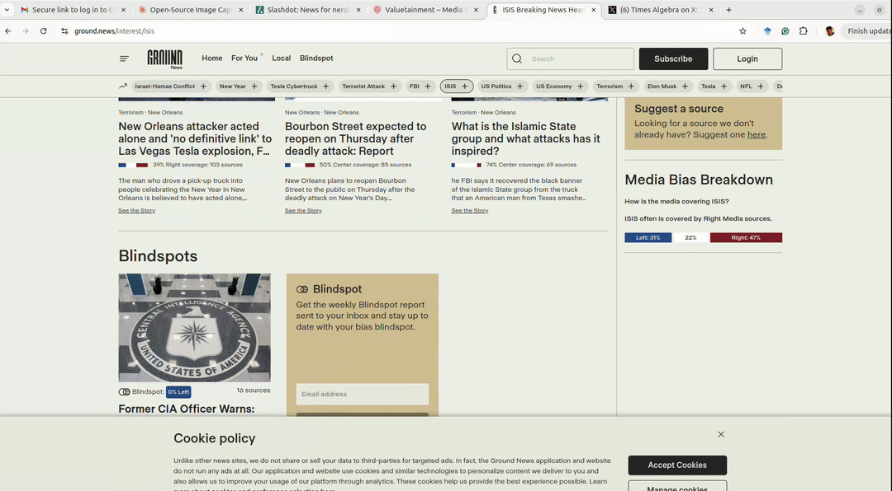
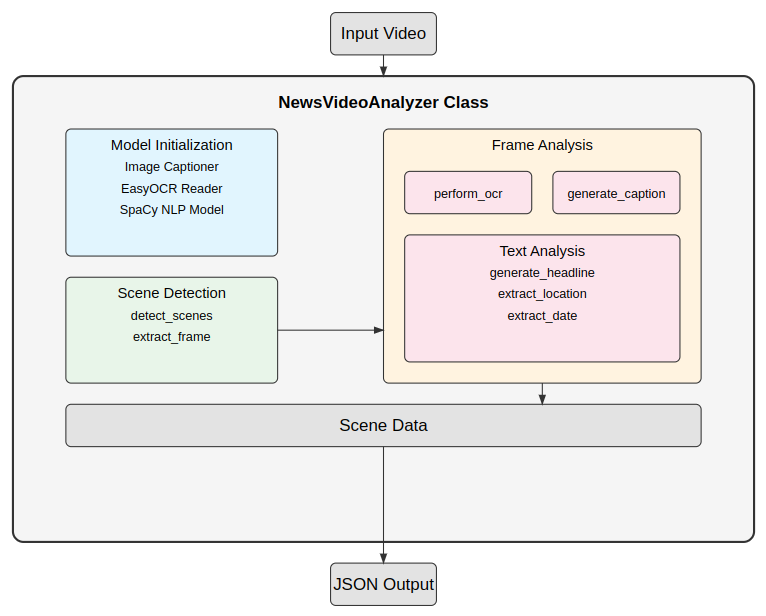

# Neural News Navigator: Deep Learning Pipeline for Screen Recording Analysis

A sophisticated computer vision pipeline that leverages state-of-the-art deep learning models to analyze screen recordings of news browsing sessions. The system performs temporal segmentation, text recognition, and visual content understanding to generate structured knowledge representations.



## Problem Overview

We address the challenging task of automated understanding of screen capture footage, specifically targeting news consumption behavior. The system processes continuous screen recordings (minimum duration: 5 minutes) and extracts a semantic representation of the content, dealing with the complexity of multi-modal data including dynamic web layouts, embedded media, and varying text formats.

### Technical Objectives
* Temporal scene segmentation using content-aware algorithms
* Dense text extraction and recognition in unconstrained environments
* Cross-modal understanding of visual media content
* Structured knowledge representation in machine-readable format

## Architectural Design

### Model Selection Rationale
The pipeline leverages the Generative Image-to-Text Transformer (GIT) architecture, specifically the textcaps variant, which has demonstrated superior performance in handling text-rich visual content. Key advantages include:

- Comparable performance metrics to BLIP while being fully open-source
- Specialized training on text-heavy visual data
- Production-ready inference capabilities
- Permissive licensing for commercial applications

### System Constraints
- Minimum temporal window: 5 minutes of continuous footage
- Input domain: Screen recordings of news browsing sessions
- Multi-modal processing capabilities for text, static images, and video content
- Structured JSON output for downstream processing

### Evaluation Metrics
1. Scene boundary detection precision/recall
2. OCR accuracy on web-based text content
3. Cross-modal caption generation quality
4. Metadata extraction accuracy (temporal, geographical)
5. Output schema compliance and completeness

## Data Pipeline

### Video Stream Preprocessing
Convert screen captures to a standardized format using FFmpeg:
```shell
ffmpeg -i /path/to/screen.webm -vf "pad=ceil(iw/2)*2:ceil(ih/2)*2" -c:v libx264 -crf 18 -preset slow -c:a aac -b:a 192k testdata.mp4
```

### Input Specifications
- Video Codec: H.264 encoded MP4/AVI
- Spatial Resolution: Minimum 720p for robust feature extraction
- Temporal Resolution: ≥30fps for smooth motion analysis
- Quality Requirements: High fidelity capture with minimal compression artifacts

### Processing Pipeline
1. Temporal Segmentation
   - Content-aware scene boundary detection
   - Adaptive keyframe extraction
   - Frame quality assessment metrics

2. Visual Processing
   - Color space normalization
   - Contrast enhancement for text regions
   - Resolution standardization
   - Noise suppression

3. Text Recognition
   - Layout-aware OCR optimization
   - Text normalization and cleaning
   - Non-textual element filtering

## System Architecture

```
|── input
│   └── testdata.mp4
├── output
│   └── results.json
├── README.md
├── ScreenGrabAnalyzer.py

└── weights
    ├── Download.md
    └── git-base-textcaps
        ├── config.json
        ├── generation_config.json
        ├── preprocessor_config.json
        ├── pytorch_model.bin
        ├── special_tokens_map.json
        ├── tokenizer_config.json
        ├── tokenizer.json
        └── vocab.txt
```

### Core Components
1. NewsVideoAnalyzer: Orchestration layer for the analysis pipeline
2. Scene Detection: Temporal segmentation module
3. OCR Engine: Text recognition and extraction
4. Caption Generator: Visual content understanding
5. Utility Functions: Common processing tools



## Experimental Validation

### Unit-level Testing
1. Scene Detection
   - Boundary detection accuracy metrics
   - Frame extraction quality assessment
   - Format compatibility verification

2. OCR Pipeline
   - Text recognition accuracy
   - Layout understanding robustness
   - Multi-script support validation

3. Caption Generation
   - Caption quality metrics
   - Visual content type handling
   - Semantic relevance evaluation

4. Metadata Extraction
   - Temporal information accuracy
   - Geographical entity recognition
   - Date format robustness

### System Integration Testing
1. End-to-End Validation
   - Pipeline completeness verification
   - Output schema validation
   - Error handling assessment

2. Performance Benchmarking
   - Processing latency analysis
   - Memory utilization profiling
   - Resource scaling characteristics

## Future Directions

### Performance Optimization
1. Memory Management
   - Streaming-based processing for large-scale videos
   - Pipeline optimization for reduced memory footprint
   - Efficient data structure implementation

### Feature Enhancement
1. Advanced NLP Integration
   - Sentiment analysis module
   - Topic modeling capabilities
   - Enhanced named entity recognition

2. Media Processing Improvements
   - Extended format support
   - Enhanced caption generation
   - Robust low-quality video handling

3. Output Flexibility
   - Multiple serialization formats
   - Configurable JSON schema
   - Database integration capabilities

### Performance Benchmarks

Single-threaded execution:
```shell
time python3 ScreenGrabAnalyzer.py -i input/testdata.mp4 -o output.json
Analysis complete. Processed 6 scenes.
Writing results to output.json

real	2m59.443s
user	14m40.914s
sys	1m35.992s
```

Multi-process execution:
```shell
time python3 ScreenGrabAnalyzerMP.py -i input/testdata.mp4 -o output.json
Analysis complete. Processed 6 scenes.
Writing results to output.json

real	3m7.505s
user	10m56.916s
sys	0m43.451s
```