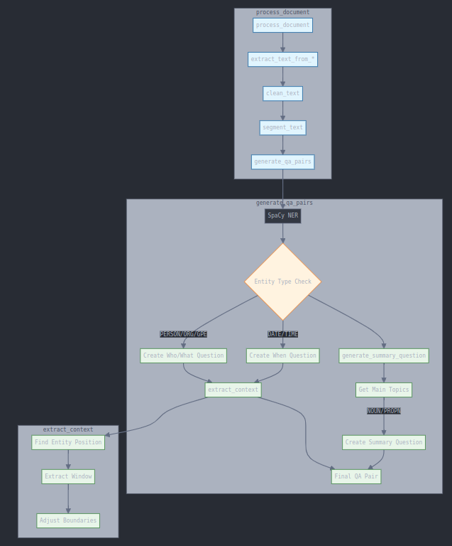

# DocumentQA: Automated Question-Answer Pair Generator for Computer Vision Scientists

Welcome to **DocumentQA**, a cutting-edge Python tool designed to automatically generate question-answer pairs from various document formats using advanced NLP and transformer models. While primarily focused on text, this tool can be a powerful asset for computer vision scientists working on multimodal datasets, combining textual and visual information for comprehensive analysis.

## Why DocumentQA for Computer Vision?

In the realm of computer vision, understanding the context and content of textual data associated with images, videos, and other visual media is crucial. DocumentQA bridges the gap between text and vision by generating meaningful QA pairs that can be used to fine-tune multimodal models, enhance dataset annotations, and improve the interpretability of visual data.

## Problem Design

### Objectives
- **Extract Meaningful Text**: From multiple document formats (PDF, TXT, SRT, HTML) often accompanying visual data.
- **Generate Relevant QA Pairs**: Create contextually relevant question-answer pairs that can be used to augment visual datasets.
- **Support Multiple Output Formats**: Generate outputs in JSON and CSV for easy integration with existing pipelines.
- **Maintain Context-Awareness**: Ensure that the generated QA pairs preserve the context, crucial for multimodal learning.

### Constraints
- **Supported Formats**: PDF, TXT, SRT, HTML.
- **Text Extraction Quality**: Dependent on document formatting.
- **Question Generation**: Limited to entity-based and summary-based questions.
- **Memory Limitations**: Based on document size.
- **Internet Connection**: Required for initial model downloads.

### Success Criteria
- **Accurate Text Extraction**: From supported document formats.
- **Contextually Relevant QA Pairs**: Ensuring the generated pairs are meaningful.
- **Multilingual Support**: Handling different languages and encodings.
- **Entity Recognition**: Accurate identification and context preservation.
- **Clean Output**: In specified formats (JSON/CSV).

## Data Preparation

### Input Processing
1. **Document Loading**
   - Multiple encoding support (UTF-8, ASCII, Latin-1, CP1252).
   - Format-specific extractors for PDF, TXT, SRT, and HTML.
   - Error handling for corrupted or unsupported files.

2. **Text Cleaning**
   - Removal of excessive whitespace and newlines.
   - Standardization of punctuation and special characters.
   - Preservation of sentence structure and context.

3. **Text Segmentation**
   - Breaking text into manageable chunks (max 100 words).
   - Maintaining sentence integrity.
   - Preserving contextual relationships.

### Model Preparation
- Automatic download of required models.
- SpaCy model for NER and text processing.
- BERT model for question answering.
- Weights management and storage.

## Code Organization

### Code Structure
```
├── autopunc.py
├── convertQA.py
├── input
│   ├── 3-Kings.pdf
│   └── Argo.htm
├── output
│   ├── Argo.csv
│   └── Argo.json
├── prepro_ytxscrips.py
├── README.md
└── weights
    └── bert-large-uncased-whole-word-masking-finetuned-squad
        ├── config.json
        ├── model.safetensors
        ├── pytorch_model.bin
        ├── README.md
        ├── saved_model.tar.gz
        ├── tokenizer_config.json
        ├── tokenizer.json
        └── vocab.txt
```

### Class Structure
```
DocumentQA/
├── __init__()              # Model initialization and setup
├── Extractors/
│   ├── extract_text_from_pdf()
│   ├── extract_text_from_txt()
│   ├── extract_text_from_srt()
│   └── extract_text_from_html()
├── Text Processing/
│   ├── clean_text()
│   └── segment_text()
├── QA Generation/
│   ├── process_document()
│   ├── generate_qa_pairs()
│   ├── extract_context()
│   └── generate_summary_question()
└── Output Handling/
    └── write_output()
```

### Key Components


1. **Document Processing**
   - Format-specific text extractors.
   - Encoding detection and handling.
   - Error management.

2. **NLP Pipeline**
   - Entity recognition.
   - Context extraction.
   - Question generation.

3. **Output Generation**
   - Format conversion.
   - File writing.
   - Error handling.

## Test Cases

### Document Loading Tests
```python
def test_pdf_extraction():
    # Test PDF with text content
    # Test PDF with images
    # Test corrupted PDF
    # Test empty PDF

def test_encoding_handling():
    # Test UTF-8 documents
    # Test documents with special characters
    # Test documents with multiple encodings
```

### QA Generation Tests
```python
def test_qa_generation():
    # Test with short text
    # Test with long text
    # Test with multiple entities
    # Test with no entities
    # Test with edge cases (empty text, special characters)
```

### Output Format Tests
```python
def test_output_formats():
    # Test JSON output
    # Test CSV output
    # Test with Unicode characters
    # Test with large datasets
```

## Further Optimizations and Improvements

### Performance Enhancements
1. **Processing Speed**
   - Implement batch processing for large documents.
   - Add multiprocessing for parallel text extraction.
   - Optimize memory usage for large files.

2. **QA Quality**
   - Implement more sophisticated question generation strategies.
   - Add support for different question types.
   - Improve context selection algorithm.

## Usage
```shell
python3 convertQA.py -i input/3-Kings.pdf -o output/3-Kings.json
python3 convertQA.py -i input/Argo.htm -o output/Argo.csv
```
