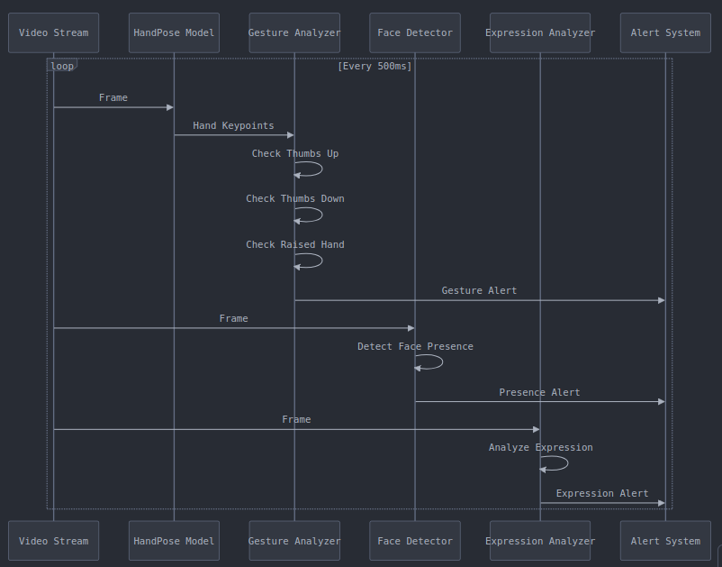

# Neural HCI: Real-time Human-Centric Perception in the Browser

A distributed machine learning system implementing real-time human understanding through multi-modal analysis of gestures and facial expressions, with practical JavaScript implementation for browser environments.

## Technical Overview

This system demonstrates real-time human perception in browser environments, focusing on low-latency gesture recognition and expression analysis. The implementation leverages WebGL acceleration through TensorFlow.js and optimized model architectures.

### Core Technical Specifications

1. Real-time Detection Parameters
   - Gesture Detection Interval: 500ms
   - Face Detection Timeout: 5000ms
   - Audio Feedback Cooldown: 5000ms
   - Target Latency: <100ms for expressions, <500ms for gestures

2. Detection Capabilities
   ```javascript
   // Supported Gestures
   - Thumbs Up    // Using thumb-index vertical relationship
   - Thumbs Down  // With finger position validation
   - Raised Hand  // Using palm-finger distance metrics

   // Supported Expressions
   - Happy        // Primary emotion
   - Sad          // Primary emotion
   - Angry        // Primary emotion
   - Surprised    // Secondary emotion
   - Disgusted    // Secondary emotion
   - Fearful      // Secondary emotion
   - Neutral      // Baseline state
   ```

### Implementation Architecture

1. Core Components:
```
├── index.html          # Entry point
├── main.js            # Core logic implementation
├── lib/               # Neural network dependencies
│   ├── handpose.js    # Hand keypoint detection
│   ├── blazeface.js   # Face detection
│   └── face-api.js    # Expression analysis
└── models/            # Pre-trained weights
```


2. Key Pipeline Functions
```javascript
async function detectGestures() {
    // Hand gesture analysis
    const handPredictions = await handposeModel.estimateHands(video);
    if (isThumbsDown(handPredictions)) {
        showAlert('👎 Thumbs down detected!', 'thumbsDown');
    } else if (isThumbsUp(handPredictions)) {
        showAlert('👍 Thumbs up detected!', 'thumbsUp');
    }
    
    // Face and expression detection
    const expressions = await faceapi.detectAllFaces(video)
        .withFaceExpressions();
    // Expression processing...
}
```

### Technical Implementation Details

1. Gesture Recognition Logic
```javascript
function isHandRaised(predictions) {
    if (predictions.length > 0) {
        const wrist = predictions[0].annotations.palmBase[0];
        const fingers = [
            predictions[0].annotations.middleFinger[3],
            predictions[0].annotations.indexFinger[3],
            predictions[0].annotations.ringFinger[3],
            predictions[0].annotations.pinky[3]
        ];
        return fingers.every(finger => finger[1] < wrist[1] - 50);
    }
    return false;
}
```

2. Expression Analysis Pipeline
```javascript
const expressions = await faceapi.detectAllFaces(video)
    .withFaceExpressions();
if (expressions.length > 0) {
    const expression = expressions[0].expressions;
    const maxExpression = Object.keys(expression)
        .reduce((a, b) => expression[a] > expression[b] ? a : b);
    // Process dominant expression...
}
```

## Performance Optimization

1. Resource Management
   - Asynchronous model loading
   - Audio preloading system
   - Frame processing throttling
   - Memory-efficient event handling

2. Error Handling Strategy
```javascript
async function loadModels() {
    try {
        handposeModel = await handpose.load();
        blazefaceModel = await blazeface.load();
        await faceapi.nets.tinyFaceDetector.loadFromUri('/models');
        await faceapi.nets.faceExpressionNet.loadFromUri('/models');
    } catch (error) {
        console.error('Error loading models:', error);
        showAlert('Error loading detection models', null);
    }
}
```

## Future Research Directions

1. Technical Enhancements
   - Implement temporal smoothing for gesture detection
   - Add multi-hand tracking support
   - Enhance expression confidence thresholds
   - Integrate continuous emotion tracking

2. Performance Optimization
   - WebGL shader customization
   - Model quantization strategies
   - Frame buffer optimization
   - Memory allocation improvements