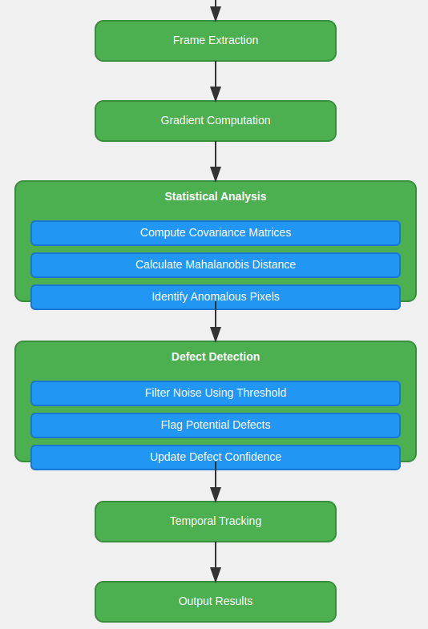

# Statistical Pixel Anomaly DEtection (SPADE)

A cutting-edge tool for detecting dead, stuck, or malfunctioning pixels in video footage using advanced statistical analysis and computer vision techniques. Perfect for computer vision enthusiasts and students looking to dive into real-world applications of image processing and anomaly detection!

## Why SPADE?

### The Problem
Dead or stuck pixels are a common issue in digital displays and camera sensors. These pixels can ruin the visual experience and are often difficult to detect manually, especially in high-resolution videos. SPADE automates this process, making it faster, more accurate, and scalable.

### The Solution
SPADE uses a **statistical approach** to detect anomalous pixel behavior in video footage. By analyzing pixel gradients and temporal persistence, SPADE can identify dead or stuck pixels with high confidence. It’s not just a tool—it’s a learning opportunity to understand how statistical methods and computer vision can solve real-world problems.

---

## What Makes SPADE Special?

### Key Features
- **Gradient Analysis**: Computes first and second-order gradients using 8-directional difference matrices.
- **Statistical Detection**: Uses **Mahalanobis distance** to identify anomalous pixel behavior.
- **Temporal Tracking**: Tracks pixel defects across multiple frames to filter out noise and transient artifacts.
- **Confidence Scoring**: Assigns confidence levels based on statistical deviation from normal behavior.
- **Real-Time Visualization**: Visualizes detected defects directly on the video for easy interpretation.
- **Multi-Threaded Processing**: Optimized for performance with multi-threading support (see `Spadeplus.cpp`).

### Why Computer Vision Students Will Love It
- **Hands-On Learning**: SPADE is a great way to learn about gradient computation, statistical anomaly detection, and video processing.
- **Real-World Application**: Understand how theoretical concepts like Mahalanobis distance and covariance matrices are applied in practice.
- **Customizable**: Experiment with different thresholds, persistence settings, and visualization options.
- **OpenCV Integration**: Built using OpenCV, the most popular library for computer vision, making it easy to extend and modify.

---

## How Does SPADE Work?

### Technical Approach
1. **Frame Extraction**: Convert video frames to grayscale for efficient processing.
2. **Gradient Computation**: Calculate directional differences using 8-directional kernels.
3. **Statistical Analysis**: Compute covariance matrices and Mahalanobis distances to identify anomalies.
4. **Temporal Aggregation**: Track defects across frames to ensure persistence and filter out noise.
5. **Visualization**: Highlight detected defects on the video for easy interpretation.

### Computational Workflow



1. **Input**: A video file with potential dead or stuck pixels.
2. **Processing**: SPADE analyzes each frame, detects anomalies, and tracks them over time.
3. **Output**: 
   - A CSV file with detailed defect information (coordinates, confidence, frame range, etc.).
   - An optional output video with defects highlighted.

---

## Getting Started

### Prerequisites
- OpenCV (C++ or Python)
- C++11 or Python 3.7+
- Basic understanding of computer vision concepts (gradients, matrices, etc.)

### Installation
#### C++ Version
```bash
# Compile the video corruptor and SPADE
g++ -std=c++11 -o videoCorruptor videoCorruptor.cpp `pkg-config --cflags --libs opencv4`
g++ -std=c++11 -o Spade Spade.cpp `pkg-config --cflags --libs opencv4`

# For multi-threaded version (Spadeplus.cpp)
g++ -std=c++11 -o Spadeplus Spadeplus.cpp `pkg-config --cflags --libs opencv4` -pthread
```

#### Python Version
```bash
pip install opencv-python numpy scipy
```

### Running SPADE
#### C++ Version
```bash
./Spade -i input_video.mp4 -o output.csv -v output_video.mp4
```

#### Python Version
```python
python Spade.py -i input_video.mp4 -o output.json -v output_video.mp4
```

---

## Code Organization

### Core Components
1. **DeadPixelDetector Class**
   - Main detection engine.
   - Handles frame processing, defect detection, and tracking.
   - Manages confidence scoring and visualization.

2. **PixelDefect Structure**
   - Stores defect information (coordinates, confidence, frame range, etc.).
   - Tracks temporal persistence and total appearances.

3. **VideoCorruptor Class**
   - Generates test data with controlled pixel defects.
   - Simulates various types of pixel failures for testing and validation.

### Implementation Variants
- **Spade.cpp**: Base C++ implementation.
- **Spade.py**: Python implementation with additional logging and JSON output.
- **Spadeplus.cpp**: Multi-threaded C++ version for improved performance.

## Further Optimizations and Improvements

### Performance Enhancements
1. **GPU Acceleration**: Leverage CUDA or OpenCL for faster gradient computation.
2. **Vectorized Operations**: Optimize matrix operations using SIMD instructions.
3. **Adaptive Thresholding**: Dynamically adjust thresholds based on video content.

### Detection Accuracy
1. **Machine Learning Integration**: Train a model to classify pixel defects.
2. **Pattern Recognition**: Detect specific patterns of stuck or dead pixels.
3. **Advanced Filtering**: Use wavelet transforms or Fourier analysis for better noise reduction.


```bash
./Spade -i your_video.mp4 -o results.csv -v output.mp4
``` 