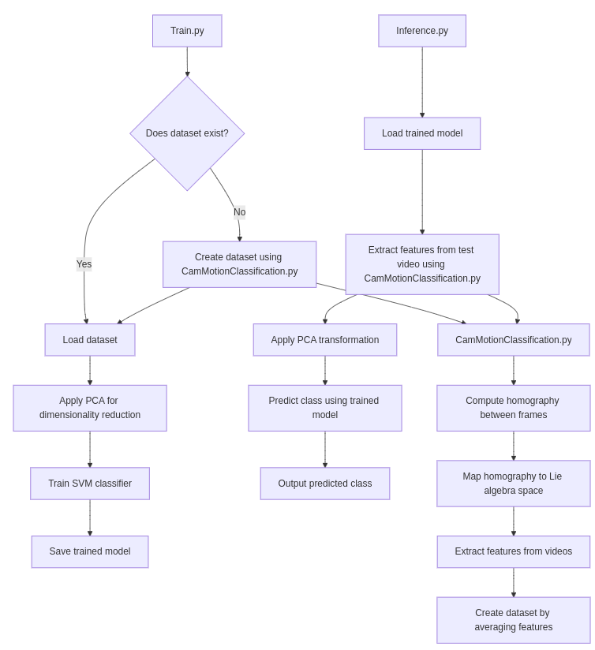
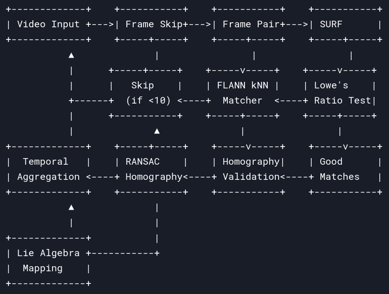

Here’s an updated version of the `README.md` with a detailed introduction to the problem, tailored for computer vision graduate students:

---

# Camera Motion Classification

This project provides tools for classifying camera motion in video sequences. It includes both Python and C++ implementations, making it suitable for both rapid prototyping and high-performance deployment.

## Table of Contents
1. [Introduction](#introduction)
2. [Python Implementation](#python-implementation)
3. [C++ Implementation](#cpp-implementation)
4. [Dependencies](#dependencies)
5. [Usage](#usage)
   - [Training the Model](#training-the-model)
   - [Running Inference](#running-inference)
6. [File Descriptions](#file-descriptions)

---

## Introduction

### Problem Statement
In computer vision, understanding camera motion is a fundamental task with applications in video stabilization, action recognition, and autonomous navigation. Camera motion can be categorized into various types, such as **panning**, **tilting**, **zooming**, and **rotation**. Automatically classifying these motions from video sequences is a challenging problem due to the complexity of motion patterns and the need for robust feature extraction.

### Why This Matters
- **Video Stabilization**: Identifying camera motion helps in stabilizing shaky videos by compensating for unwanted movements.
- **Action Recognition**: Camera motion classification can improve action recognition systems by separating camera-induced motion from object motion.
- **Autonomous Systems**: In robotics and autonomous vehicles, understanding ego-motion (camera motion relative to the environment) is critical for navigation and mapping.

### Technical Approach



This project uses **homography estimation** and **Lie algebra mapping** to extract features from video frames. Homography captures the geometric transformation between consecutive frames, while Lie algebra provides a compact representation of these transformations in a vector space. These features are then used to train a classifier (e.g., SVM) to predict the type of camera motion.

### Key Contributions


- **Feature Extraction**: Utilizes SURF (Speeded-Up Robust Features) for detecting keypoints and computing homographies.
- **Lie Algebra Mapping**: Maps homographies to a vector space for efficient classification.

---

## Python Implementation

### Dependencies
To run the Python implementation, ensure the following Python packages are installed:
- `opencv-python`
- `scipy`
- `numpy`
- `scikit-learn`
- `joblib`

You can install these dependencies using `pip`:
```bash
pip install opencv-python scipy numpy scikit-learn joblib
```

### Usage

#### Training the Model
To train the model using the Python implementation, run the following command:
```bash
python Train.py -v <video_directory> -d <dataset_file> -m <model_file>
```
- `<video_directory>`: Directory containing video files for training.
- `<dataset_file>`: Output file to save the dataset (default: `output/dataset.npz`).
- `<model_file>`: Output file to save the trained model (default: `output/CamMotionModel.pkl`).

#### Running Inference
To classify camera motion in a test video, run the following command:
```bash
python Inference.py -m <model_file> -t <test_video_path>
```
- `<model_file>`: Path to the trained model file (default: `output/CamMotionModel.pkl`).
- `<test_video_path>`: Path to the test video file.

---

## C++ Implementation

### Dependencies
To compile and run the C++ implementation, ensure the following libraries are installed:
- **OpenCV** (for image processing)
- **Eigen** (for matrix operations)
- **Boost** (for serialization, optional for PCA/SVM)

#### Installation on Ubuntu
```bash
sudo apt-get install libopencv-dev libeigen3-dev libboost-all-dev
```

### Compilation
To compile the C++ code, use the following commands. Ensure that the paths to Eigen and Boost are correctly specified in your environment.

#### Compile `CamMotionClassification.cpp`:
```bash
g++ -std=c++17 -o CamMotionClassification CamMotionClassification.cpp -I/usr/include/eigen3 -I/usr/include/boost -lopencv_core -lopencv_highgui -lopencv_imgproc -lopencv_xfeatures2d
```

#### Compile `Train.cpp`:
```bash
g++ -std=c++17 -o Train Train.cpp -I/usr/include/eigen3 -I/usr/include/boost -lopencv_core -lopencv_highgui -lopencv_imgproc -lopencv_xfeatures2d
```

#### Compile `Inference.cpp`:
```bash
g++ -std=c++17 -o Inference Inference.cpp -I/usr/include/eigen3 -I/usr/include/boost -lopencv_core -lopencv_highgui -lopencv_imgproc -lopencv_xfeatures2d
```

### Usage

#### Training the Model
To train the model using the C++ implementation, run the following command:
```bash
./Train -v <video_directory> -d <dataset_file> -m <model_file>
```
- `<video_directory>`: Directory containing video files for training.
- `<dataset_file>`: Output file to save the dataset (default: `output/dataset.npz`).
- `<model_file>`: Output file to save the trained model (default: `output/CamMotionModel.pkl`).

#### Running Inference
To classify camera motion in a test video, run the following command:
```bash
./Inference -m <model_file> -t <test_video_path>
```
- `<model_file>`: Path to the trained model file (default: `output/CamMotionModel.pkl`).
- `<test_video_path>`: Path to the test video file.

---

## File Descriptions

### Python Files
1. **CamMotionClassification.py**: Contains the `CamMotionClassifier` class for feature extraction and dataset creation.
2. **Train.py**: Script to train the camera motion classification model.
3. **Inference.py**: Script to classify camera motion in a test video using the trained model.

### C++ Files
1. **CamMotionClassification.cpp**: C++ implementation of the `CamMotionClassifier` class.
2. **Train.cpp**: C++ script to train the camera motion classification model.
3. **Inference.cpp**: C++ script to classify camera motion in a test video using the trained model.

---

## Notes
- Ensure that the video files are in `.mp4` format.
- The Python implementation is easier to set up and run, while the C++ implementation is more performant but requires additional setup.
- For the C++ implementation, serialization of the PCA and SVM models is not fully implemented. You may need to extend the code to handle this.
