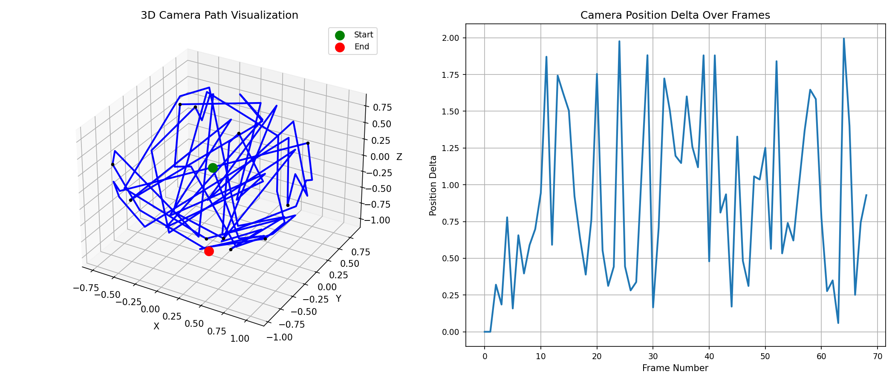
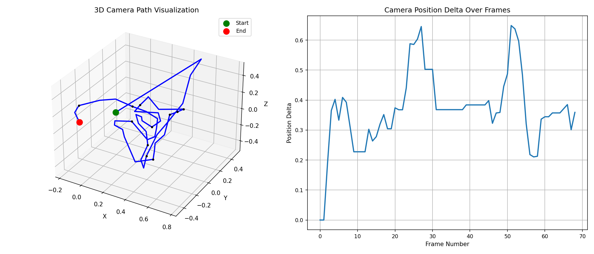
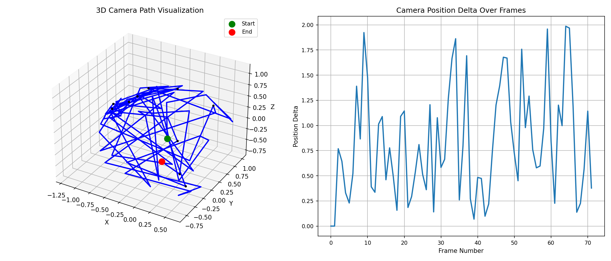
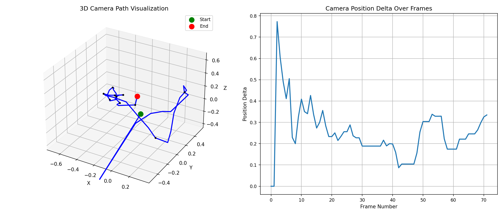

# Camera Pose Estimation from Video

This project estimates 6DoF (6 Degrees of Freedom) camera poses from video frames using feature-based methods.The core theory behind this camera pose estimation is based on the **epipolar geometry** of two views. The system estimates camera motion by analyzing how feature points move between consecutive video frames. For a calibrated camera (where its internal optics are known), matching points between two frames reveal geometric constraints about the camera's movement. The key mathematical object is called the essential matrix, which encodes the relationship between the camera's rotation and translation based on these point correspondences. This matrix is computed robustly using RANSAC to handle outliers from incorrect feature matches.

From the essential matrix, we decompose it to extract the camera's rotation (as a 3D orientation matrix) and translation (as a 3D direction vector). Since we can't determine the absolute distance traveled from images alone (the scale ambiguity problem), the system includes heuristic methods to maintain consistent scale across frames. The final pose is refined by ensuring the estimated movement aligns well with the observed feature movements in the image, and temporal smoothing is applied to reduce jitter in the estimates. This approach effectively builds up the camera's trajectory frame by frame through visual analysis of how the scene appears to change from different viewpoints.

## Input data preparation
(Optional STEP: if input videos are missing)
```shell
ffmpeg -i ../ex12/input/coupe.mp4 -an \
-c:v libx264 \
-vf "scale=1920:1440,setdar=4/3,setsar=1/1,format=yuvj420p" \
-r 6 \
-video_track_timescale 12288 \
-b:v 9415k \
-coder ac \
-flags +loop \
-x264-params "cmp=+chroma+trellis" \
-movflags +faststart \
-crf 24 \
input/v_c.mp4

ffmpeg -i ../ex13/input/hummer.mp4 -an \
-c:v libx264 \
-vf "scale=1920:1440,setdar=4/3,setsar=1/1,format=yuvj420p" \
-r 6 \
-video_track_timescale 12288 \
-b:v 9415k \
-coder ac \
-flags +loop \
-x264-params "cmp=+chroma+trellis" \
-movflags +faststart \
-crf 24 \
input/v_h.mp4
```

## Key Computational Blocks

### 1. Feature Detection and Extraction

**Basic Version (ORB):**
```cpp
Ptr<ORB> orb = ORB::create();
orb->detectAndCompute(gray, noArray(), keypoints, descriptors);
```
- Uses ORB (Oriented FAST and Rotated BRIEF) features
- Fast but less accurate for pose estimation
- Binary descriptors with Hamming distance matching

**Enhanced Version (SIFT):**
```cpp
Ptr<SIFT> detector = SIFT::create(0, 3, 0.04, 10);
detector->detectAndCompute(gray, noArray(), keypoints, descriptors);
```
- Uses SIFT (Scale-Invariant Feature Transform) features
- More accurate but computationally intensive
- Floating-point descriptors with L2 norm matching

### 2. Feature Matching

**Basic Version:**
```cpp
matcher.match(prevDescriptors, descriptors, matches);
// Simple distance threshold filtering
```
- Basic brute-force matching with distance threshold

**Enhanced Version:**
```cpp
matcher.knnMatch(prevDescriptors, descriptors, knn_matches, 2);
// Ratio test filtering (Lowe's ratio test)
```
- Uses k-NN matching with ratio test
- More robust to false matches
- Typically retains only high-confidence matches

### 3. Essential Matrix Estimation

```cpp
E = findEssentialMat(prevMatchedPoints, matchedPoints, cameraMatrix, 
                    RANSAC, 0.999, 1.0, mask);
```
- Estimates the essential matrix from point correspondences
- Uses RANSAC for robust estimation
- In enhanced version: tighter parameters (0.9999 confidence, 0.5 pixel threshold)

### 4. Pose Recovery

```cpp
recoverPose(E, prevMatchedPoints, matchedPoints, cameraMatrix, R, t, mask);
```
- Decomposes essential matrix to get rotation and translation
- Returns relative camera motion between frames
- Translation is up to scale for monocular sequences

### 5. Pose Refinement 

**Scale Estimation:**
```cpp
currentScale = estimateScale(prevMatchedPoints, matchedPoints);
t *= currentScale;
```
- Heuristic scale estimation for monocular sequences
- Helps maintain consistent scale across frames

**Temporal Smoothing:**
```cpp
poseHistory.addPose(currentPose);
currentPose = poseHistory.getSmoothedPose();
```
- Maintains a window of previous poses
- Applies moving average smoothing
- Reduces jitter in pose estimates

## Compile

1. **Basic Version:**
   ```bash
   g++ -std=c++11 cpe.cpp -o cpe `pkg-config --cflags --libs opencv4`
   ```

2. **Enhanced Version** (uncomment `#define ENHANCE`):
   ```bash
   g++ -std=c++11 cpe.cpp -DENHANCE=ON -o cpe `pkg-config --cflags --libs opencv4`
   ```

## Analysis

### Visualizaion

Input Video                |  Basic Estimation              | Enhanced Estimation                |
------------------|-----------------------------------------|------------------------------------|
 |  |   | 
 |  |   | 

### Computational complexity 

The following provide an idea on the runtime of both the basic version and 
the enhanced version

#### Basic version
```shell
$ g++ -std=c++11 cpe.cpp -o cpe `pkg-config --cflags --libs opencv4`
$ time ./cpe input/v_c.mp4 output/v_c_basic.json
Video info:
  FPS: 6
  Reported frames: 69
  Calculated duration: 11.5
Processed 69 frames. Results written to output/v_c_basic.json

real	0m4.673s
user	0m8.492s
sys	0m1.200s

$ time ./cpe input/v_h.mp4 output/v_h_basic.json
Video info:
  FPS: 6
  Reported frames: 72
  Calculated duration: 12
Processed 72 frames. Results written to output/v_h_basic.json

real	0m4.767s
user	0m8.769s
sys	0m1.089s
```

#### Enhanced version

```shell
$ g++ -std=c++11 cpe.cpp -DENHANCE -o cpe `pkg-config --cflags --libs opencv4`
$ time ./cpe input/v_c.mp4 output/v_c_enhanced.json
Video info:
  FPS: 6
  Reported frames: 69
  Calculated duration: 11.5
Processed 69 frames. Results written to output/v_c_enhanced.json

real	0m42.278s
user	1m17.763s
sys	0m18.097s

$ time ./cpe input/v_h.mp4 output/v_h_enhanced.json
Video info:
  FPS: 6
  Reported frames: 72
  Calculated duration: 12
Processed 72 frames. Results written to output/v_h_enhanced.json

real	0m4.750s
user	0m8.708s
```