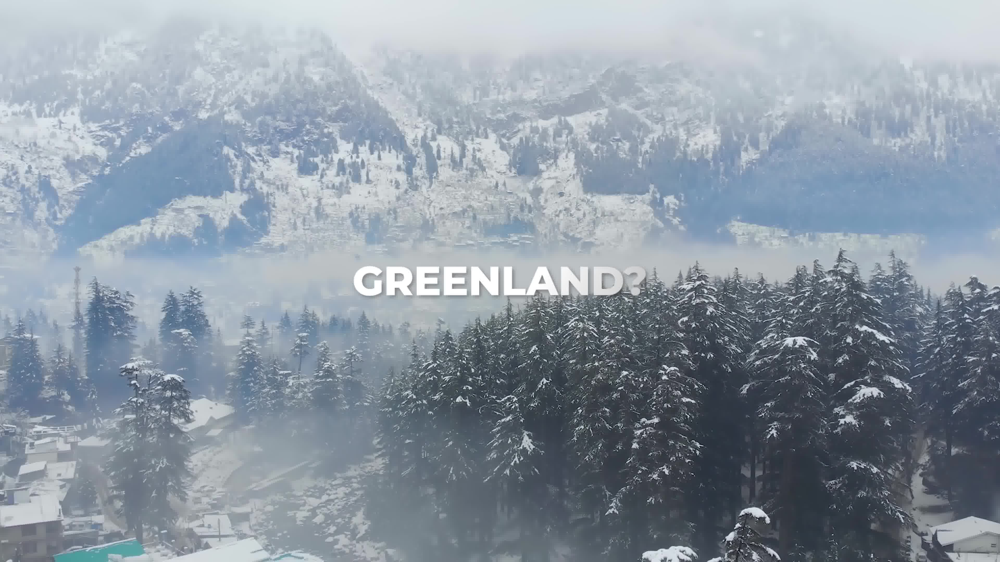

## Video search with image query
The objective of this exercise is to understand inner workings of an image search computational pipeline.
For the scope of this exercise, we are assuming our query is a single image, and our database is either 
a video or a directory containing the frames extracted from the video.

Query Image/Frame |  Video (Shown as GIF) | Result |
------------------|-----------------------|--------|
 |  | Frame Number: 99 | 

### Problem formulation

We set the premise of this problem by identifying a canonical representation of an image which will be
used as a query against a collection of such representations of images. In essence, we are building a 
pictorial diectionary for our video or sequence of images to facilitate search. Each word in the 
aforementioned dictionary is comprised of a combination of letters from the alphabet. Similarly, each 
entry in our pictorial dictionary will be created using a combination of "visual letters". This visual 
letter corpus forms the basis of our representation. 

To build this representation, the following criteria should be considered:
1. Image transformation invariance (rotation, scaling, translation, skew)
2. Image intensity/colorspace invariance (B/W, RGB etc)
3. Robust to noise

Most convolutional neural network trained for object recognition/image classification provide the above 
functionalities. Here we select a ResNet50 classification architecture as our candidate for image 
representation. Some key attributes of the ResNet50 architecture are summarized as follows:

1. ResNet50 is a 50-layer deep convolutional neural network with a specific structure:
- Consists of multiple "residual blocks" that allow for very deep networks
- Designed to solve the vanishing gradient problem in deep neural networks
- Pre-trained on ImageNet with 1000 image classification categories

2. When we remove the final classification layer, we're left with the feature extraction layers:
- Input: 224x224x3 color image
- Goes through multiple convolutional layers
- Each layer learns increasingly abstract and complex features
- The last convolutional layer (before the classification layer) produces a 2048-dimensional feature vector

3. Feature Hierarchy:
- Early layers: Detect low-level features like edges, colors, and simple textures
- Middle layers: Detect more complex patterns like shapes, parts of objects
- Later layers: Detect high-level semantic features like object types


### Data Preparation

1. Downloading query and dataset

```shell
# Download test data (video file)
yt-dlp -S ext:mp4:m4a https://www.youtube.com/watch?v=rTDaZoDDW5g -o rTDaZoDDW5g.mp4
```

```shell
# Extract all frames from video
ffmpeg -hide_banner -thread_queue_size 8192 -i rTDaZoDDW5g.mp4 frames/%06d.jpg
```

```shell
# Create small testset for quick testing
ffmpeg -i rTDaZoDDW5g.mp4 -ss 00:00:20 -to 00:00:30 test.mp4
ffmpeg -i test.mp4 testframes/%06d.jpg 
```
2. Data Organization
```shell
tree -L 1 

├── frames
├── rTDaZoDDW5g.mp4
├── testframes
├── testIndex-f.json
├── testIndex-v.json
└── test.mp4

2 directories, 4 files
```

3. Useful transcode for visualization 
```shell
# Generating GIF from frames
OPTS="fps=25000/10001,scale=1080:-1:flags=lanczos,split[s0][s1];[s0]palettegen[p];[s1][p]paletteuse"
IP="/path/to/input.mp4"
OP="/path/to/output.gif"
ffmpeg -ss 05 -t 2 -i $IP -vf $OPTS -loop 0 $OP
```

### Code Organization
```shell
tree

├── buildIndex.py
├── embeddings.py
├── getSimilarity.py
├── __pycache__
│   └── embeddings.cpython-310.pyc
├── queryDataset.py
└── README.md

1 directory, 6 files

```
### Test cases

1. Image Similarity

```shell
python3 getSimilarity.py -q ../../data/ex01/testframes/000010.jpg -t ../../data/ex01/testframes/000011.jpg
Image Similarity: 0.9946704506874084
```
2. Building index for future query
```shell
# Using sequence of images as input
python3 buildIndex.py -i ../../data/ex01/testframes/ -o ../../data/ex01/testIndex-f.json
Image sequence processed
Processed 300 frames. Index saved to ../../data/ex01/testIndex-f.json

# Using video as input
python3 buildIndex.py -i ../../data/ex01/test.mp4 -o ../../data/ex01/testIndex-v.json
Video processed
Processed 300 frames. Index saved to ../../data/ex01/testIndex-v.json
```
3. Search and retrieval

```shell
# Query against frame based imdex
python3 queryDataset.py -q ../../data/ex01/testframes/000100.jpg -i ../../data/ex01/testIndex-v.json
Most Similar Frame:
Frame Number: 99
Cosine Similarity: 0.8103252220706153

# Query against video based index 
python3 queryDataset.py -q ../../data/ex01/testframes/000100.jpg -i ../../data/ex01/testIndex-f.json
Most Similar Frame:
Frame Number: 99
Cosine Similarity: 1.0000000046178263
```

### Further Optimizations and improvements